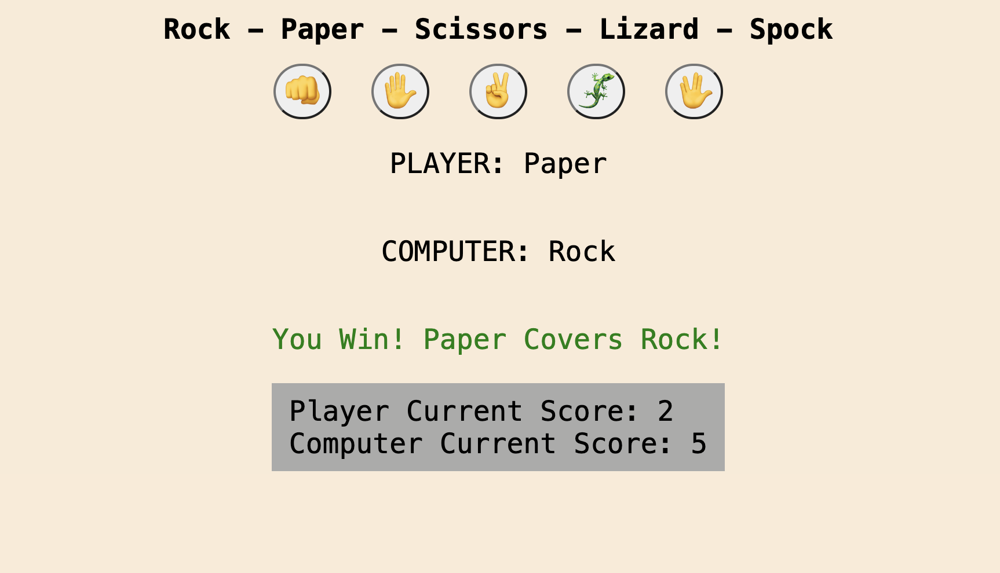

# Rock-Paper-Scissors-Lizard-Spock

Fun game of Rock, Paper, Scissors, Lizard, Spock made in Javascript.

## Description

I've been learning Javascript and whilst doing the 'mandatory' rock, paper, scissor tutorial from Bro Code on YouTube I
decided to add some 'complexity' to it to demonstrate to myself that I understood what I was learning.
Im a big fan of the Bing Bang Theory so it was only natual to add Lizard and Spock into the mix!

The website is simple, you have 5 options to choose from, 'Rock','Paper','Scissors','Lizard','Spock', once you have
selected your option the computer will choose an option at random and you will be shown the outcome.
First to 10 wins!

  

  

Bro Code video link below
________________________________________________________
[Build JavaScript ROCK PAPER SCISSORS in 18 minutes! 👊](https://www.youtube.com/watch?v=3uKdQx-SZ5A&t=772s)
________________________________________________________

## Getting Started

### Dependencies

* 
* 
* 

### Executing program

* Simply open the HTML page

## Version History

* 0.1
    * Initial Release

## License

Distributed under the GNU General Public License v3.0. See `LICENSE.txt` for more information.

## Acknowledgments

Inspiration, code snippets, etc.
* [Bro Code: YouTube](https://www.youtube.com/@BroCodez)
* [Big Band Theory](https://bigbangtheory.fandom.com/wiki/Rock,_Paper,_Scissors,_Lizard,_Spock)
